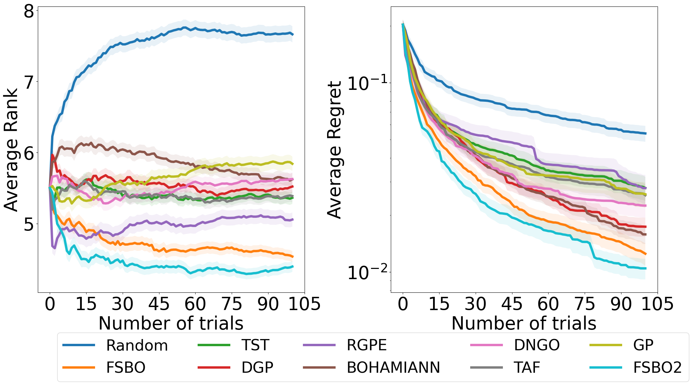

# FSBO

**Few Shot Bayesian Optimization**

This Repo contains the implementation of [FSBO](https://arxiv.org/abs/2101.07667) applied to [HPO-B](https://github.com/releaunifreiburg/HPO-B) benchmark. Please download the data from the benchmark data in order to reproduce results. 

## Folder Structure:

- **./** : Main code base
- **checkpoints** : Meta-trained models per search space with the default configuration from the code base.
- **results** : Results after meta-testing the pretrained models
- **benchmark_results** : JSON files for plotting
- **plots** : Results plots

## Requirements

- Gyptorch 1.4.2
- Pytorch 1.8.1
- Numpy 1.20.3

## Usage

* Train on search space:

`
python fsbo_metatrain.py --space_id 6767
`

* Test on search space and dataset:

`
python fsbo_test.py --space_id 6767 --dataset_id 31
`

* Aggregate results in a JSON and plot results:

`
python generate_json.py
`

`
python fsbo_benchmark_plot.py
`
## Results
**FSBO** is the model version used in the [HPO-B](https://datasets-benchmarks-proceedings.neurips.cc/paper/2021/hash/ec8956637a99787bd197eacd77acce5e-Abstract-round2.html) paper, **FSBO2** is the model version used in this refactored code-base.



## Cite us

This code is a refactoring of the original code used in [HPO-B](https://datasets-benchmarks-proceedings.neurips.cc/paper/2021/hash/ec8956637a99787bd197eacd77acce5e-Abstract-round2.html) paper. If you use this code, please cite us:

```

@article{pineda2021hpob,
  author    = {Sebastian Pineda{-}Arango and
               Hadi S. Jomaa and
               Martin Wistuba and
               Josif Grabocka},
  title     = {{HPO-B:} {A} Large-Scale Reproducible Benchmark for Black-Box {HPO}
               based on OpenML},
  journal   = {Neural Information Processing Systems (NeurIPS) Track on Datasets and Benchmarks},
  year      = {2021}
}
```


